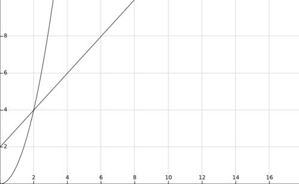

以下内容转自
[算法时间复杂度的表示法O(n²)、O(n)、O(1)、O(nlogn)等是什么意思？ - 缪志威的回答 - 知乎](https://www.zhihu.com/question/21387264/answer/253704111)

在数学上定义：存在常数 c, 使得当 N >= c 时 T(N) <= f(N)，表示为T(n) = O(f(n))。

我们先从头开始看：

```
int aFunc(void) {
   printf("Hello, World!\n");      //  需要执行 1 次
   return 0;       // 需要执行 1 次
}
```

那么上面这个方法需要执行2次运算

```
int aFunc(int n) {
   for(int i = 0; i < n; i++) {         // 需要执行 (n + 1) 次
       printf("Hello, World!\n");      // 需要执行 n 次
   }
   return 0;       // 需要执行 1 次
}
```
这个方法需要 (n + 1 + n + 1) = 2n + 2 次运算。

我们把算法需要执行的运算次数用输入大小 n 的函数表示，即 T(n)。
此时为了估算算法需要的运行时间和简化算法分析，我们引入时间复杂度的概念。

**数学上定义：存在常数 c，使得当 N >= c 时 T(N) <= f(N)，表示为 T(n) = O(f(n))。**

怎么理解呢？

如图：


**当 N >= 2 的时候，f(n) = n^2 总是大于 T(n) = n + 2 的，于是我们说 f(n) 的增长速度是大于或者等于 T(n) 的，也说 f(n) 是 T(n) 的上界，可以表示为 T(n) = O(f(n))。**

因为 f(n) 的增长速度是大于或者等于 T(n) 的，即T(n) = O(f(n))，所以我们可以用 f(n) 的增长速度来度量 T(n) 的增长速度，所以我们说这个算法的时间复杂度是 O(f(n))。

**所以就有了我们现在理解的时间复杂度，记作: T(n) = O(f(n))，用来度量算法的运行时间。它表示随着 输入大小n 的增大，算法执行需要的时间的增长速度可以用 f(n) 来描述。**

显然如果 T(n) = n^2，那么 T(n) = O(n^2)，T(n) = O(n^3)，T(n) = O(n^4) 都是成立的，但是因为第一个 f(n) 的增长速度与 T(n) 是最接近的，所以第一个是最好的选择，所以我们说这个算法的复杂度是 O(n^2) 。

可以参考[十分钟从零搞定时间复杂度](https://www.jianshu.com/p/f4cca5ce055a)