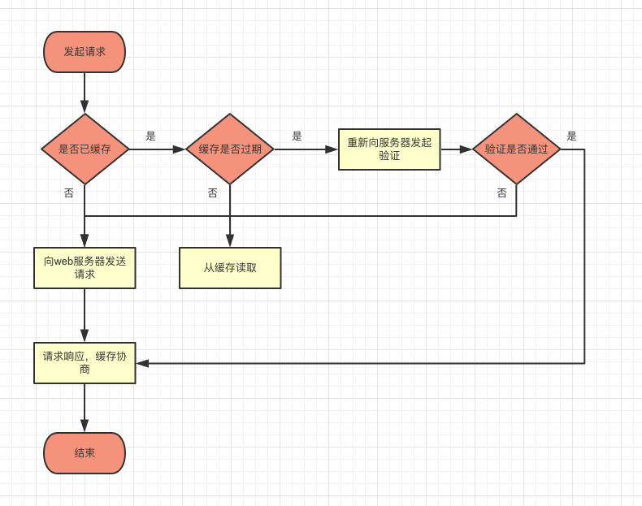

使用缓存的目的就是在于减少计算、IO、网络等时间，可以快速的返回，特别是流量比较大的时候，可以节约很多服务器带宽和压力。

一个请求从缓存的方面来说，有三个过程。

### 本地检查缓存是否过期

`Expires`，http1.0版本定义的response头部，定义过期时间，如果本地时间发现超过过期时间，就会向服务器请求，进行文件新鲜度检测。**但是会有一个问题，就是本地的操作系统时间可能偏差比较大，导致缓存时间过长或者永远都缓存不了。**

`Cache-control: max-age=xxx`，http1.1版本定义的response头部，就是为了解决操作系统时间与服务器时间相差太大的问题。文件缓存存活时间，请求完毕的时候，会记录本地的时间。再次请求的时候，此时时间减去最初记录时间，如果时间大于max-age，就会进行文件新鲜度检测。

- 如果浏览器使用本地缓存，通过chrome调试工具，可以看到，状态是200，size是`from cache`。这个时候是没有http请求的。

- 如果缓存不存在或者没有定义这两个头部，直接进行下一步新鲜度检测。

- 如果两个都定义的话，`Expires`无效。

- 防止浏览器缓存，我们需要把两个头部都设置为0。

### 服务器检测文件新鲜度

本地缓存过期，缓存和服务器文件可能一样，也有可能不一样。如果一样的话，就没有必要返回内容。如果不一样，就返回内容，就相当于一次新的请求。

怎么判断文件是否一致呢？现在的做法是通过文件生成时间或者文件进行MD5值计算。

`Last-Modified`，文件生成时间或者最后修改时间。下一次请求的头部，添加`If-Modified-Since`，值是上次response头部的`Last-Modified`值，和服务器进行对比，如果一样的话，直接返回304，数据内容为空。**【这里也会存在一个问题，如果文件定期更新，但是文件内容不更新，岂不是白白耗费流量】**

`Etag`，服务器端对文件计算出来的一个值。下一次请求的头部，添加`If-None-Match`，和服务器进行对比，如果一样的话，直接返回304，数据内容为空。

### 服务器返回数字内容

相当于一次新的请求，状态是200.

通过输出4个头部，来控制缓存，减少压力，不仅可以节省服务器和宽带资源，对用户的体验提升也是非常有帮助的。

整体上可以看到可能出现的情况。200（`from cache`，无请求），304（仅仅是头部交换，没有response body返回），200（一次完整的请求，包含response body）。

