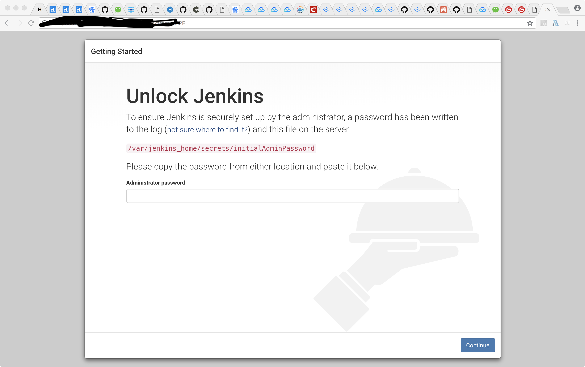
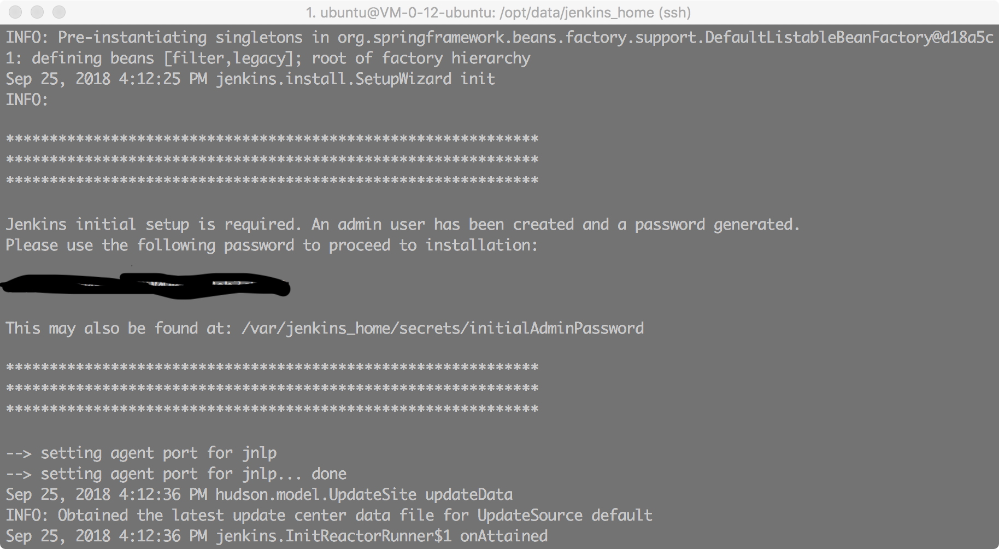
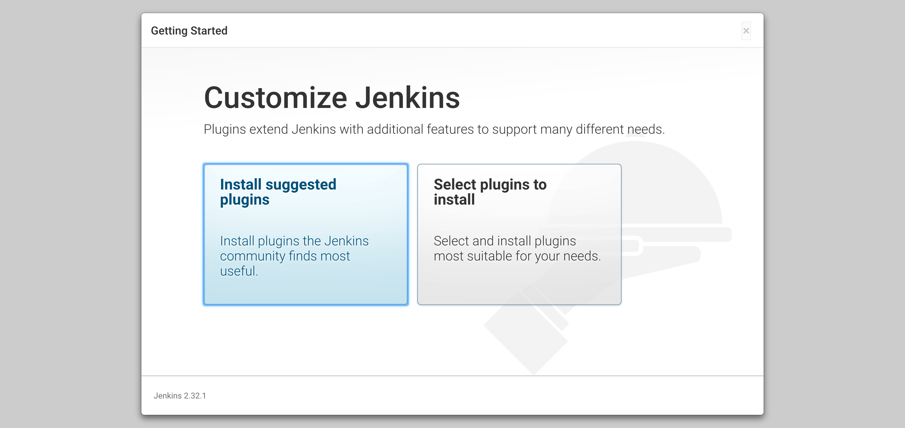
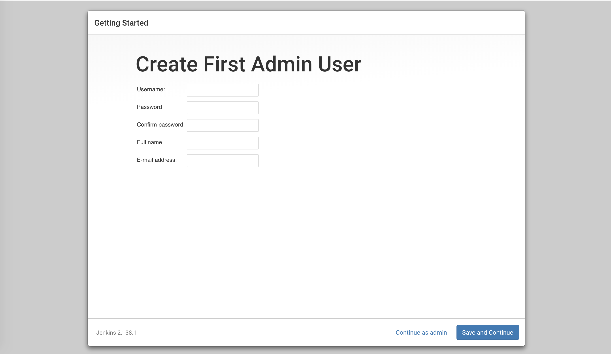

> 服务器为腾讯云Ubuntu

### 一、安装Docker

1. 更新`apt`包
```bash
$ sudo apt update
```
2. 安装最新版本的Docker

中文版教程： [如何在Ubuntu上安装使用Docker](https://cloud.tencent.com/developer/article/1167995)

不过最好还是看英文版：[install-using-the-repository](https://docs.docker.com/install/linux/docker-ce/ubuntu/#install-using-the-repository)

或者使用官方Ubuntu存储库中提供的Docker安装包，但是可能不是最新的版本。
```bash
# 使用内置安装
$ sudo apt-get install docker.io
# 卸载
$ sudo apt-get purge docker.io
```

### 二、安装Jenkins

使用docker安装Jenkins非常方便，只需要执行下面命令即可。
```bash
docker run --name devops-jenkins --user=root -p 8080:8080 -p 50000:50000 -v /opt/data/jenkins_home:/var/jenkins_home -d jenkins/jenkins:lts
```
更多定制参数可以参考 https://github.com/jenkinsci/docker

### 三、配置Jenkins

启动Jenkins之后，在浏览器输入http://部署jenkins主机IP:端口 (8080)


根据提示，从输入administrator password 或者可以通过启动日志
```bash
docker logs devops-jenkins
```
查看这个password


选择安装插件方式，这里默认第一个


进入插件安装界面，连网等待插件安装

安装完插件后，进入创建管理员界面

