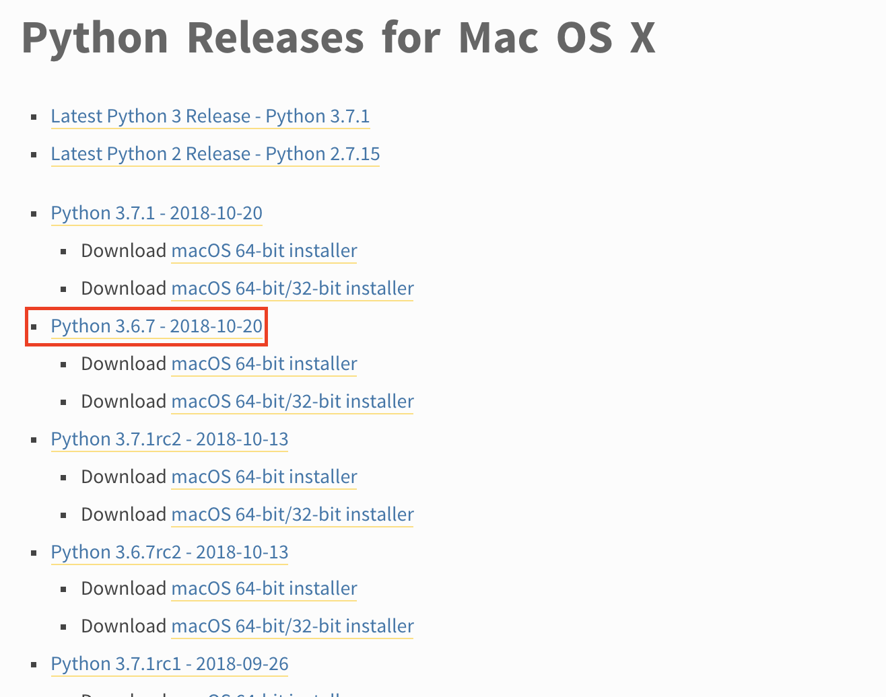

## 前言
要使用 TensorFlow 非常简单。运行 TensorFlow 需要 Python，只需安装好 Python 运行环境，通过 `pip`包管理器安装即可。

> 因为最新的 TensorFlow 不支持 Python 3.7，而使用 Homebrew 安装 python 会默认安装最新版本，即3.7，因此这里不使用 Homebrew。

### 1. 安装 Python 开发环境
TensorFlow 支持 Python 2 和 Python 3，这里我们选择 Python3。
> 要求 Python 3.4，3.5 或者 3.6

先查看是否安装了 python 环境
```bash
python3 --version
pip3 --version
vritualenv --version
```
如果这些包都已经安装，则可以跳过下面步骤到[步骤2](#2-创建虚拟环境（推荐）)。否则需要安装 [Python](https://www.python.org/downloads/mac-osx/)，[pip 包管理器](https://pip.pypa.io/en/stable/installing/)和 [Virtualenv](https://virtualenv.pypa.io/en/stable/)（用来创建隔离的 Python 环境的工具）。

1.1 安装 Python
点击 [Python 下载](https://www.python.org/downloads/mac-osx/)，选择对应的 `Python 3.6.7 - 2018-10-20` 安装包，下载安装到Mac即可。


```bash
# 查看是否安装成功
python3 --version
pip3 --version
```
1.2 安装 vritualenv
```
sudo pip3 install -U virtualenv  # system-wide install
```

### 2. 创建虚拟环境（推荐）
Python 虚拟环境用于将软件包的安装与系统环境进行隔离。

2.1 首先创建一个新的虚拟环境，这里我们需要选择一个 Python 解析器和创建一个`./venv`目录。
```bash
virtualenv --system-site-packages -p python3 ./venv
```

2.2 使用 source 命令激活虚拟环境。
```bash
source ./venv/bin/activate  # sh, bash, ksh, or zsh
```

2.3 当虚拟环境被激活时，你的 shell 提示符前缀为`(venv)`。在虚拟环境中安装软件包，不会影响主机系统设置。
首先升级`pip`：
```bash
(venv) $ pip install --upgrade pip

(venv) $ pip list  # show packages installed within the virtual environment
```
接着退出`virtualenv`：
```bash
(venv) $ deactivate  # don't exit until you're done using TensorFlow
```

### 3. 安装 TensorFlow pip包
选择以下 TensorFlow 软件包的一个进行安装：
- `tensorflow` —— 仅适用于CPU的当前版本（推荐初学者使用）
- `tensorflow-gpu` —— [支持GPU](https://tensorflow.google.cn/install/gpu)的当前版本（`Ubuntu` 和 `Windows`）
- `tf-nightly` —— 仅适用于CPU的每晚构建版本（不稳定）
- `tf-nightly-gpu` —— [支持GPU](https://tensorflow.google.cn/install/gpu)的每晚构建版本（不稳定，`Ubuntu` 和 `Windows`）

> 软件包的依赖项都会自动安装。这些列在`REQUIRED_PACKAGES`下的[`setup.py`](https://github.com/tensorflow/tensorflow/blob/master/tensorflow/tools/pip_package/setup.py)文件中。

```bash
(venv) $ pip install --upgrade tensorflow
```

验证是否安装成功：
```bash
(venv) $ python -c "import tensorflow as tf; tf.enable_eager_execution(); print(tf.reduce_sum(tf.random_normal([1000, 1000])))"
```

如果输出结果，则说明 TensorFlow 安装成功！

### 参考

[https://tensorflow.google.cn/install/pip?lang=python3](https://tensorflow.google.cn/install/pip?lang=python3)
